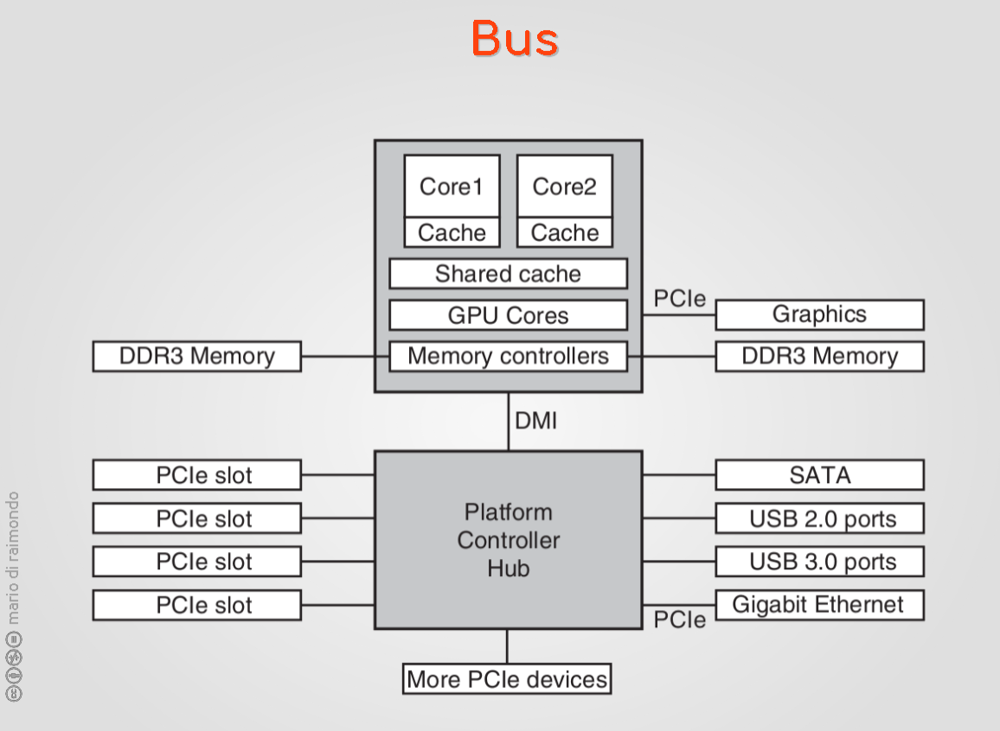
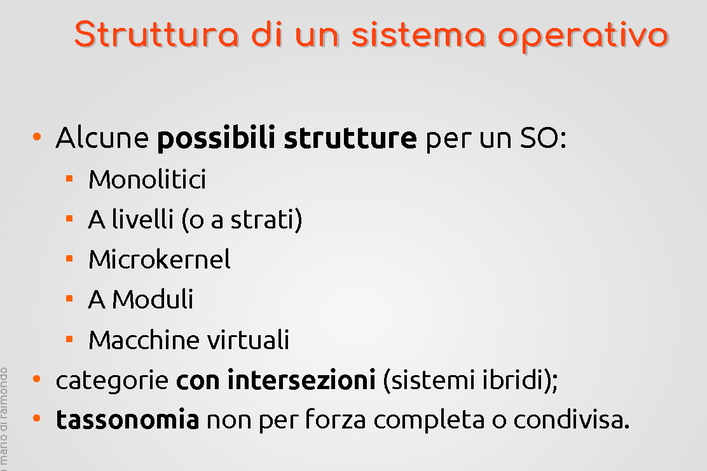
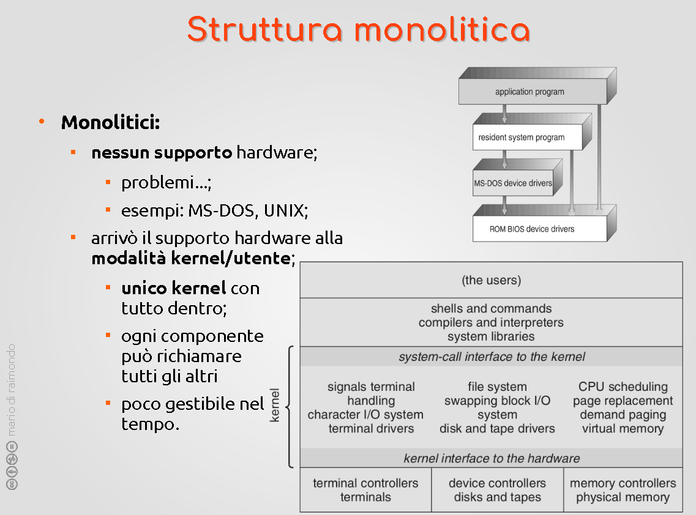

# SISTEMI OPERATIVI - 03

## Dispositivi di I/O

Driver = fa parte del Kernel e ne fa parte; viene eseguito in modalità Kernel. Come avviene l'interazione del SO tra driver e controller?

Sono operazioni lente: non si svolgono in un tempo definito; lento rispetto ai tempi tipici della CPU. Nel tempo in cui l'informazione arriva alla CPU essa avrà già fatto molto altro. Da questo dipende anche la velocità di alcune SYSCALLS, che saranno lente o bloccanti (dietro cui c'è una richiesta lenta rispetto ai tempi della CPU.) Richiesta proviene da un processo che ha bisogno di leggere da disco: il processo, finché il dato che gli serve non arriva, è bloccato.

Quindi il SO mette P in uno stato di pausa e la CPU.  

Tipicamente quando una richiesta è lenta c'entra un dispositivo I/O.  

Le chiamate non lente/bloccanti non comportano ritardi e sono considerate generalmente rapide.  

I dati passano dal controller prima di passare alla RAM. IO->Buffer del controller -> RAM.

I canali di comunicazione tra controller -> RAM: utilizzando i drivers -> Le porte del controller. Possiamo  immaginare che il Controller abbia diverse porte con diversi significati, prestabiliti.  

Come fa il SO a capire cosa c'è nella porta? La legge continuamente. (come un ciclo for). (Detto POLLING) Attesa attiva di un evento asincrono che si manifesterà. Funziona, però il problema è che è uno spreco. Utilizziamo una risorsa (CPU) per fare qualcosa che potrei delegare ad altro. Overhead di sistema: costo da pagare per fare funzionare il sistema stesso. Teoricamente si può calcolare in tempo della CPU passato in modalità kernel piuttosto che nei processi utenti. PErò è fisiologico. L'obiettivo è ridurre questi costi il più possibile.

Interrupt: aiutano ad evitare questo meccanismo. Notificano eventi, e spesso sono legati ai dispositivi I/O. Esempio lettura da disco.

Il DISK CONTROLLER attiva l'interrupt -> (in questo modo il SO non deve fare pooling) -> La CPU viene interrotta e quello che la CPU stava facendo viene sospeso/salvato

Identifica la richiesta e il processo che viene innescato.  

Se il processo era bloccato dalla chiamata lenta, poi il processo continua con i dati ricevuti dalla chiamata.  

I controller moderni utilizzando il meccanismo del [DMA -> Direct Memory Access](https://it.wikipedia.org/wiki/Direct_Memory_Access).

Trasporto dei dati all'interno della memoria senza utilizzare CPU né sistema operativo: corsia preferenziale a livello di hardware.  

La gerarchia tra gli interrupt non è fondamentale -> però qua non dipende per niente dal DMA (esso viene utilizzato per la gestione di una richiesta in particolare)

La priorità si riscontra quando ci sono più richieste in pendenza, ma questa logica viene alterata quando ci sono altri pesi. Non sono proprio prestabilite ma il SO ha il potere di gestire il controllo degli interrupt  

---

## BUS  

Non esiste un solo bus che collega tutto ma diversi che hanno diverse prerogative. Bus dedicati ad altissima velocità. Con velocità inferiori con tutto il resto delle periferiche e dispositivi IO di varia natura. Quasi tutti i BUS della figura sono standard e prestabiliti. Esempi di bus standard: tutti quelli degli [USB](https://it.wikipedia.org/wiki/USB). **DMI** -> Bus a collo di bottiglia molto efficace. Protocolli proprietari etc 

La velocità di un Bus -> Capacità di trasportare dati in una determinata quantità di dati. Esempio sui PCIe (Peripheral Component Interconnect Express). Esso è più semplice rispetto a  un parallelo (è seriale). Canale attraverso cui trasporto una parola alla volta, controllato dal controller. Multiplexare nel tempo le varie richieste. La logica è, più linee assegno a un processo più il processo è veloce. Passo da una richiesta ad un'altra meno frequentemente

---

## SISTEMI OPERATIVI e DISTINZIONI  

Tipologie di sistemi operativi e ambienti. Differenze non sempre nette. A volte sono tangibili; ad esempio alcuni SO sono specifici in alcuni settori; altri sono più scalabili a seconda delle esigenze e modulari e possono essere usati in diversi scenari.

- SO per servers/mainframes
    -> Sistemi di elaborazione con capacità di elaborazione e storage e carico di lavoro molto alto (moltissime richieste e jobs/tasks verso il sistema). In termini di capacità di calcolo mooolto maggiori di quello a cui siamo abituati quotidianamente. Calcolatori enormi. Il SO deve gestire richieste parallele; sistema multiprogrammato. Non solo gestire le proprie CPU ma si trova a gestire centinaia di CPU dello stesso laboratorio o storage. Alto carico di richieste Input/Output. Secondariamente, ambiente server. Offerte di servizi o servizio di calcolo puro. Non c'è l'operatore che fa qualcosa, si utilizza soprattutto dall'esterno. Richieste parallele molteplici. Multiprogrammazione importante. Sistemi da cui ci si aspetta stabilità. Importante poter gestire diversi utenti con diversi diritti. Tracciamento e gestione delle risorse. Percentuali di CPU che ogni utente può usare.  
 
- SO per personal computers
    -> Condividono i processi del primo, sono mutuati dalle esigenze dei servers e mainframes in "piccolo"; abbiamo bisogno di multiprogrammazione, molti li utilizziamo in "multifinestra" <-> "multiprocesso" ma ci sono molti processi che in realtà non ci rendiamo conto di aver lanciato. Ognuno ha un ruolo ben preciso, sono lanciati dal sistema operativo, non li implementiamo direttamente ma sono necessari. La differenza sostanziale è la scala. Esigenza della protezione dei processi. Avere un sistema robusto che protegga un processo dagli altri. Installare programmi a piacimento; possiamo anche cambiare il sistema operativo stesso. Nuova esigenza: sistema facilmente utilizzabile, quindi una GUI, che era assente nei servers e nei mainframes. Le GUI sono nate per i sistemi personal. Esigenze di questo settore specifico.

- SO per palmari/mobile/smart-phone
    -> Parte comune: multiprogrammazione. Modello mobile -> livello più stringente di granularità dei processi con le protezioni. I permessi. Gestione ad hoc delle risorse per l'ottimizzazione della batteria. Interfacce GUI importante. Personalizzare il sistema. Applicazioni installate con modello ancora più stringente forse, ma l'isolamento delle app garantisce o diminuisce il rischio di interferenze tra le app stesse. Mutuato da tecniche nate dai sistemi server -> usate dai personal -> poi  nei mobile. Cambiare sistema operativo è più raro ma possibile.  

- SO sistemi integrati e embedded
    -> Non c'è una differenza netta; una fase "selvaggia"??? A volte si usano le cose mutuate ma è possibile che TV o Router utilizzino lo stesso kernel dello smartphone; sistema LINUX che funziona e soddisfa esigenze di elaborazione. Assimilabili a sistemi di multiprogrammazione. Mutuano anche il modello della app. Dispositivo casalingo. Possono avere al loro interno un sistema di elaborazione. Processi che governano dispositivi. Monitorano segnali e sensori. E' ancora utile il modello a processi. Ci sono diverse differenze: molti meno processi, ma spesso sono processi ben precisi e identificabili. L'utilizzatore non ha né possibilità né esigenza di installare altre applicazioni o aggiungere altri processi. Meno importanza a incasellare i processi perché sono alcuni fissi e costruiti assieme, in caso di problemi speriamo che i danni siano minimi.

- SO real-time
    -> Molto specifici, industriali. Processi finalizzati a far funzionare cose specifiche: catene di montaggio; una serie di processi che governano specifiche azioni o organizzazione. Multiprogrammazione e forse multiutenza. Hanno un ambito di utilizzo che richiede cose ben precise, legate alla TEMPESTIVITA'. Esempio: monitoraggio temperatura. A differenza degli altri, devono garantire la tempestività. I ritardi che potrebbero avere gli altri non sono tollerabili; molte delle metodologie che usiamo  negli altri OS non vanno bene per questi sistemi. Più semplici o comuni. Sistema reattivo e tempestivo. -> Altra caratteristica: sistemi chiusi. Viene progettato tutto assieme e in una volta, i processi vengono predeterminati e l'azienda non può cambiarli. Molte esigenze non ci sono. I sistemi realtime per raggiungere tempestività e prevedibilità sacrificano altro che invece servers e pc hanno. Utilizzano la CPU diversamente. Sistema collaborativo, tanto sono pochi processi che "si conoscono" tra di loro (progettati in giustapposizione tra di loro) dove la CPU viene ceduta spontaneamnete da un processo all'altro per  il "bene comune". Permette di togliere meccanismi che appesantiscono i sistemi generici mantenendo il sistema elementare. Circoscrivono il tempo di attesa dei processi, tecniche più semplici per essere più spedito. Cosa che non avviene nei sistemi che fanno uso di prelazione (preventive). In realtà ci sono differenze tra hard e soft realtime. Differiscono nei tempi di reazione e nelle conseguenze delle mancate reazioni. Ritardi più o meno tollerabili. Esempio di soft realtime: stereo ad alta fedeltà.  

---

## Struttura di Sistema Operativo

---

### ***Struttura monolitica***

Coincide col tipo di progetto dei primi esempi di sistemi operativi. E' una struttura molto semplice e elementare; non ha supporti hardware, ma ha struttura snella e elementare. Non implementavano molte cose di un moderno sistema operativo, ad esempio la protezione. Non la potevano implementare perché mancavano alcuni strumenti offerti dall'hardware. Esempi: [MS-DOS](https://en.wikipedia.org/wiki/MS-DOS). Molto simile ai sistemi unix, a linea di comando, era monoprogramma e buono per i primi computer. Non c'era alcuna protezione; non c'era problema per i processi che andavano sugli altri processi perché banalmente non c'erano gli altri processi. Quel poco codice non aveva esigenze di organizzare le sue componenti così; primi esempi del progenitore dei sistemi UNIX. [github rep nella pagina wiki](https://github.com/microsoft/MS-DOS)

**Monolitico** --> si riferisce al progetto software in sé. Tutto il codice una volta compilato diventa un unico blocco di codice caricato in memoria centrale

(spaghetti code)  

Il cosa ci sta dentro dipende dai programmatori/progettisti del sistema operativo. Qualità e organizzazione del codice: nei primi l'organizzazione era scarsa così era scarsa anche la mantenibilità nel tempo. Ma monolitico non vuol dire solamente una cosa negativa: oggi si intende --> Tutto ciò che viene considerato kernel viene girato assieme. Un progetto che dal pov di organizzazione è visto come un monoblocco, la cui qualità dipende da come è stato progettato. (Già identificare le diverse parti è un modello più organizzato. Nei primi esempi non era sempre vero.) I sistemi UNIX erano migliori, MS-DOS era abbastanza ehh. 

---

### ***Struttura a livelli***

Mantengono il concetto di Kernel unico che viene caricato in memoria; uno degli obiettivi è quello di aiutare a scrivere un codice migliore facilitando la scrittura e il testing.  
I sistemi a strati; l'idea è di implementare delle astrazioni. Sistema operativo a strati. Lo strato più inferiore lo possiamo immaginare come l'hardware, ovvero la base sulla quale andiamo ad operare. Ogni singolo strato superiore è una componente software identificabile come oggetto: deve implementare qualcosa. Ad esempio uno può gestire il concetto di CPU virtuale: capacità di astrarre la risorsa. Ad esempio questo può essere l'obiettivo di uno di questi strati. Perché questo stacking l'uno sull'altro? Perché immaginiamo che abbia il compito di servire agli utilizzatori (lo strato che sta sopra) i servizi dello strato sottostante tramite una interfaccia. Ci sono una serie di punti di accesso (non proprio syscalls, quelle sono le cose che il SO offre ai processi interni: per adesso parliamo di cose interne.) Gli strati superiori sanno di poter far uso degli strati sottostanti. Ad esempio immaginiamo lo strato della memoria virtuale sopra quello delle CPU virtuali --> Non si occuperà del problema di condividere le risorse -> Lo lascia allo strato sottostante. Offre un modello e strumenti più comodi per lavorare; offre una interfaccia per quella sopra e utilizza l'interfaccia di quello sotto. Perché questo modello? Oltre ad essere più ordinato  

Moduliamo molti dei vantaggi della OOP; l'elenco dei metodi e degli strumenti e delle cose, ma non ci si preoccupa di come gli altri "oggetti" facciano le cose, semplicemente ne utilizzo i metodi. RETI -> il problema di mettere in comunicazione tutti i dispositivi è un CASINO. Approcciato con un approccio a strati dove il protocollo non è unico ma c'è una stack di protocolli, utilizzati in ambiti diversi. La complessità è gestibile proprio perché ha una struttura a strati. E' anche un modo per sviluppare codice che funziona.

E ogni parte è più piccola e limitata rispetto a una progettazione limitata; questo aiuta sia la scrittura che il testing che il mantenimento. Una volta che so che lo strato 1 funzioni posso lavorare sullo strato 2. Senza incasinare. Sono astrazioni che via via si appoggiano le une alle altre e alla fine offro tutti i servizi. Lavorare gli strati in maniera isolata permette di sostituire le astrazioni pur di mantenere la stessa interfaccia superiore e ricostruendo sopra quella inferiore. Questo è un modello più evoluto rispetto al monolitico ma ha dei problemi:

1) Di cosa si deve occupare ogni strato?
2) Cosa va sopra e cosa va sotto?

Le scelte e i compromessi non sempre saranno ottimali. Ad esempio Storage sotto a memoria virtuale. Il problema è che quello sopra si deve appoggiare a quello sotto e quello sotto non può usare i servizi di quello sopra. E allora dove metto il concetto di CPU virtuale? Sopra la memoria virtuale? Potrebbe aver bisogno della dipendenza con lo storage. Però se la CPU la metto sopra alla memoria virtuale diventa un problema per gli strati di sotto che devono barcamenarsi senza la cosa della CPU virtuale. Allora posso provare a metterlo sotto lo Storage in modo che quelle routine possano lanciare le tasks in maniera asincrona per uno pseudoparallelismo.  

Ci sono dei pro e contro, per l'utilizzo delle astrazioni e della gerarchia. Problematiche nel decidere quali sono i vari strati e chi deve fare cosa.  

Altro vincolo:  

3) Uno strato può sfruttare i servizi degli strati sottostanti ma fino a un certo punto;  

In realtà posso usare solo i metodi dell'interfaccia che mi sta direttamente sotto e non posso bypassare gli strati. Sembra una cosa minore ma in realtà crea delle dipendenze scomode; non posso però vincolare a tutte le altre altrimenti diventa un casino e dovrei cambiare tutto ogni volta. Questo però vuol dire che richiedendo i servizi le richieste vengano inoltrate da uno strato all'altro (sono delle chiamate di funzione!) Tutto ciò comunque vive all'interno del Kernel, con lo stesso livello di priorità e importanza; però c'è una struttura interna. Ognuno parla solo con lo strato di sotto solo per una questione di organizzazione di software. Questo però appesantisce la comunicazione. Se non lo facessi però rischierei di rompere l'isolamento e l'organizzazione software.  
