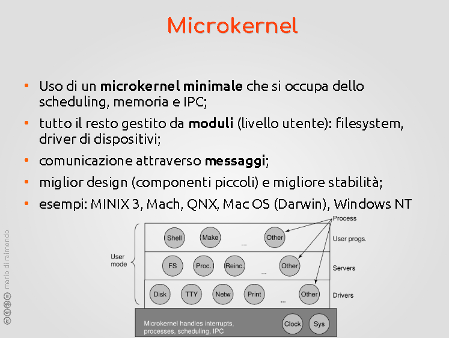
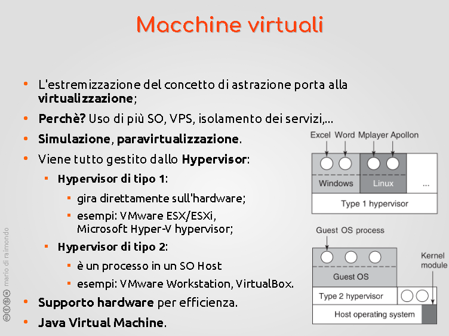
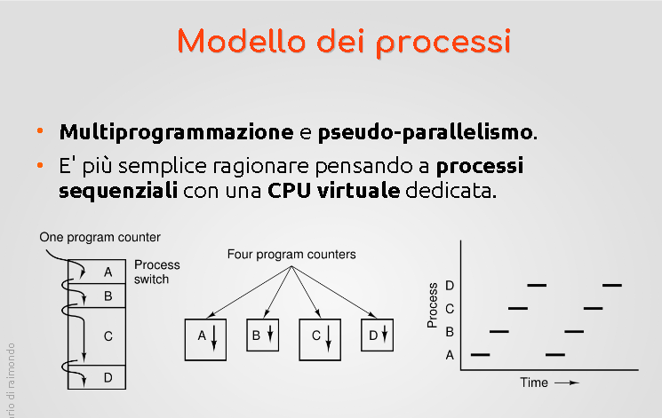

# SISTEMI OPERATIVI - 04

-> Tutorato: verrà bandita una richiesta. Verso la fine del semestre e sulla parte di laboratorio.  

## Struttura a Microkernel

  
Il problema della struttura a strati è che aumenta tantissimo l'overhead a causa delle chiamate nidificate di un livello superiore ai livelli inferiori.  
[MICROKERNEL](https://en.wikipedia.org/wiki/Microkernel) = Tanenbaum afferma che esso sia il migliore sistema.  
L'idea è che -> Esistono varie componenti al suo interno. Si individua una componente  centrale o indispensabili che sarà una sorta di kernel ristretto -> Microkernel che avrà delle funzionalità indispensabili, e tutte le altre verranno collocati all'interno di processi utente. In termini di poteri saranno alla pari di un normale processo utente: alcune parti del sistema operativo gireranno in MOD Utente e altri che gireranno in  MOD Kernel.  

Riducendo il kernel in una cosa più piccola aiuta a: Creare un microkernel scritto meglio, potenzialmente un numero di bug minore. 
Anche i moduli in modalità utente potrebbero avere dei bugs. Ma isolando il microkernel, e le funzionalità buggano, il bug farà bug minori. Non potrà andare a toccare il codice del microkernel, né inficiare le altre funzionalità contenute in altri processi utente, perché nel modello a processi i messaggi che deve passare fa in modo che ogni processo sia protetto e isolato dagli altri. Ciò promette una maggiore robustezza di struttura.  

Cosa metto nel microkernel? Secondo quale logica?  
Tutto quello che sta nel microkernel è una sorta di "zoccolo duro" ovvero qualcosa che sta alla base, basso livello, e indispensabile al resto. Gestione dei processi, scheduling: il resto di basa su esso. Ciò che serve per implementare i processi.  

Come comunicano i processi tra di loro e con il microkernel?  
Modello a messaggi. -> Permette ai processi di comunicare fra di loro e a microkernel. Funzionalità insita nel microkernel stesso. Feedback inviato da una parte all'altra, ma non c'entra il networking. Non esce dalla macchina. E' il sistema operativo che si occupa  di fare da "postino". Nel mkrnl ci sono anche il meccanismo di interrupt, IPC, gestione di memoria.  

Cosa c'è negli altri programmi in usermode?  
Gestione dischi e filesystem, l'idea di isolarli = offre una maggiore  robustezza e isolamento = sistema resistente. "Reincarnation"? --> si occupa di monitorare come va, se gli altri servizi stanno bene o sono bloccati. Se vanno male, questo processo chiude/ammazza quel processo e lo fa ripartire/ripristina correttamente.  

In foto: MINIX3 (scritto da Tanenbaum.) utilizzato in alcune componenti delle CPU intel. Ma non ha molto uso. Però è interessante perché implementa le cose in maniera pulita(??).

Anche il sistema dei Mac (Mac OS). Sotto microkernel, ma è anche un ibrido che mutua idee dagli altri progetti (in parte a strati, in parte a moduli). E' un misto di cose mutuate.  

WINDOWS NT --> Overhead intrinseco, obbligo di comunicare con gli altri. Problematici e non possiamo bypassarle. E' diventato praticamente tutto di nuovo monolitico.

--- 

## Struttura a Moduli  

Progettazione a moduli = idea della OOP. Questo nucleo principale di funzionalità assieme ai moduli una volta eseguiti  vengono eseguiti tutti assieme nello spazio kernel. Anche i moduli girano in modalità kernel. Si sfrutta la OOP: l'isolamento delle funzionalità. Il concetto del modulo può essere estesa ad ogni componente. Ad esempio, quando parleremo di SCHEDULING (scegliere il processo che la CPU dovrà utilizzare dopo) e vedremo che non c'è algoritmo unico. Ogni OS ha una scelta. Linux è diverso: gli algoritmi di scheduling stessi sono modulari. Vale anche per altre cose: schede audio, etc.  
Pro e contro:  
Un modulo che gira in modalità contro  può fare danno.  
Però essendo dentro il kernel stesso non ha problemi di performance né di comunicazioni con gli altri moduli e le altre parti del sistema operativo. Se un modulo ha bisogno di un altro servizio o modulo lo può fare direttaemente chiamandolo senza mandare messaggi. Questo aumenta l'efficienza del sistema e riduce l'overhead. Modello migliore/più efficiente in fatto di  comunicazion e tra moduli.  
QUindi posso anche sostituire un modulo, metterne un altro che fa la stessa cosa.  

Come faceva prima un processo utente a dialogare con un IO?  
O una chiamata di sistema gestita tramite messaggi (microkernel), il quale controlla tutte cose, eventualmente limita danni etc, e poi inoltra la richiesta utilizzando la richiesta.  

Vantaggio E svantaggio(?).  

Altri vantaggi:    
[----------]
    Processi e modalità implementate a RUNTIME. IL SO carica in memoria un modulo e lo  usa quando gli serve  (????).

Progetto può essere mantenuto dalla community stessa. L'obbiezione sulla potenziale instabilità del sistema -> l'evidenza controbatte. Linux è uno dei più stabili di tutti, e il fatto che il codice sia aperto e sotto gli occhi di tantissimi professionisti aiuta tantissimo.  

---

##  Macchine virtuali  

Estremizzazione del concetto di astrazione. Esempio della CPU virtuale -> ogni astrazione crea qualcosa che prima non c'era, di molto specifico. creare tutto ciò che compone una macchina vera; una astrazione che simuli una intera macchina, ovvero collezione di unità di elaborazione; non è una idea del tutto nuova.  
Idea di un sistema per istanziare intere macchine all'occorrenza. All'interno del SO ospitato dentro la macchina virtuale -> Esercizio  di scatole cinesi.  
Esempi di vantaggi:  
    Idea di ospitare un altro sistema operativo, un modo di allenarsi; funziona bene e ciò dipende dal fatto che -> permette di eseguire l'SO fittizio quasi efficentemente quanto un software che gira sull'hardware stesso, ad eccezione per le cose che fanno pesante IO.  
Istanziare più macchine virtuali -> il sistema operativo ospitato non sa e non si accorge di star girando dentro una macchina virtuale, di solito; non è necessario avere un supporto ad hoc.  
Può essere utile  per lo sviluppo di piattaforme multipiattaforma, per testare. Sviluppo web, testing su diverse piattaforme e browsers.  
Vantaggi anche sulla sicurezza.  
(modello a container: tipo docker. ha meno overhead rispetto alle intere macchine virtuali)

### Virtualizzazione

Il codice verrà eseguito direttamente sulla CPU fisica (per questo l'efficienza è alta.)

Il codice del processo viene eseguito bene finché non viene eseguita una chiamata di sistema. A quel punto il controllo viene passato a qualcosa di simile a  un monitor di macchine virtuali o hypervisor. Il compito dell'HV è implementare gli effetti della trap. In realtà la cpu che esegue la macchina virtuale è in mod utente. La macchina si aspetta un mod kernel. L'hypervisor si occupa di simulare  il mod kernel. Questo è il motivo per cui molte chiamate di sistema (di solito IO) appesantiscono. Hardware moderno aiuta sulla virtualizzazione e la perdita si assottiglia sempre di più.  

### Hypervisors di diversi tipi

1) tipo 1: gira direttamente sull'hardware. Tipo dualboot? 
2) tipo 2: software all'interno di una macchina che viene messo sopra un  sistema operativo ospitante (tipo virtualbox) modalità utente ad eccezione di alcune modalità che possono girare/installate come parti del sistema operativo (hook)

KVM -> tipo 1 su linux

Paravirtualizzazione (dove il so ospitante sa di essere in un a VM) (XEN)

---

## PROCESSI  

Definizione: una istanza di esecuzione di un programma.  
Tutto ciò che sta dentro il suo spazio  di memoria troviamo il suo codice, i dati (che possono essere statici o dinamici (heap)).  
Stack (dinamico). 
Struttura  lineare (sequenza di words). Può essere implementato in tanti modi (3a parte del corso). Ad ogni processo viene assegnato uno spazio di memoria di una certa ampiezza.  
Altre cose che stanno fuori dal processo ma che fanno parte del suo stato:  

    -> registri della cpu durante la sua esecuzione
    -> files aperti, allarmi pendenti
    -> processi imparentati fra di loro: ogni processo della macchina, a parte il processo genitore di tutti, sono imparentati fra di loro: ogni processo è creato da un processo. In ogni SO la creazione di un  processo scaturisce da una istanza di un processo che già esiste. 

Init --> processo iniziale. Poi parentela "ad albero"

Strutture dati: la principale è la tabella dei processi, il cui generico record è il cosiddetto PCB (Process Control Block). Finché è vivo ha un suo record all'interno della PCB. Una serie di slot -> una struttura deallocata statica con una certa etcetc. Il numero della tabella associato al processo lo chiameremo PID e sarà il nome vero e proprio del processo. Identificativo univoco assegnato all'atto della creazioen del processo stesso. Potrebbe anche essere riciclato in futuro.  

Struttura separata e distinta dallo spazio usato dagli altri processi

Modello di processi -> Quello che permette di fare la CPU virtuale è avere un modello dove le cose possono essere eseguite o in sequenzialità  oppure in pseudoparallelo giocando  con la possibilità di salvare e ripristinare i vari processi.

La creazione di un processo avviene sempre su richiesta di un altro processo ad eccezione del processo INIT che viene creato dal sistema operativo all'inizio. Sono richieste ben precise: la creazione di un processo avviene sempre tramite una chiamata di sistema.  

Due approcci alla creazione di processi

1) Alla Unix -> Sdoppiamento del padre, approccio alla FORK. Chiamata di sistema elementare/semplice da un processo. La fork crea un clone. P2 sarà un CLONE di P1. Ha il minimo indispensabile di modifiche per distinguerlo dal genitore. E' una entità separata, a sé stante rispetto a P1, essi di P2 saranno una copia speculare identica a quelli di P1. La fork si combina con la EXEC -> che permette di fare quello che mi serve. La fork ha una condizione che fa capire se siamo nel contesto del padre o del figlio. Se (padre) [P1], else [P2]. gli fa gli auguri di festa del papà lmao  
Nel codice della exec invocata da un dato processo ha un effetto di svuotare lo spazio di indirizzamento e azzerare lo status del processo già esistente e (indicando il percorso di un file binario eseguibile) e quel codice che sta sul disco verrà inserito nell'area dove sta il codice e avrò stack vuoto e sostanzialmente svuota il contenitore che ho creato con la fork e lo riempie con il codice binario eseguibile che gli indico.  Perché duplicare il file/forkarlo? Perché in realtà questa fork/clonazione è istantanea che non viene completata finché non è strettametne necessario e giustifica  il fatto di "clonarlo".
2) Alla Windows -> CreateProcess. Chiamata di sistema più complicata con più parametri. Va a creare un NUOVO processo. L'obbiettivo è lo stesso, ma tipo UNIX viene meglio in realtà e ci piace di più W linux.