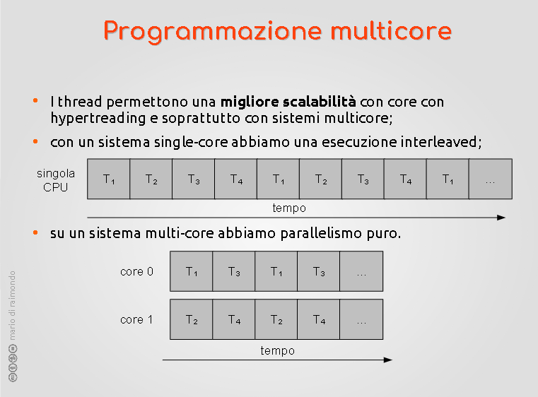
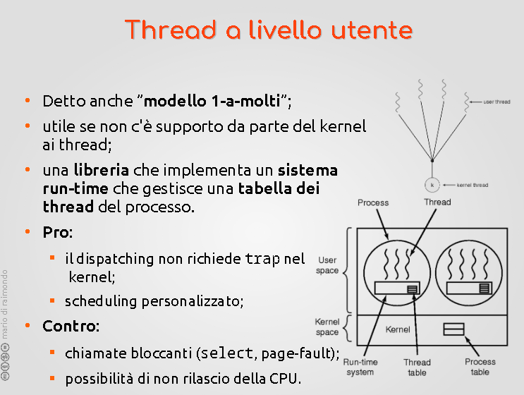
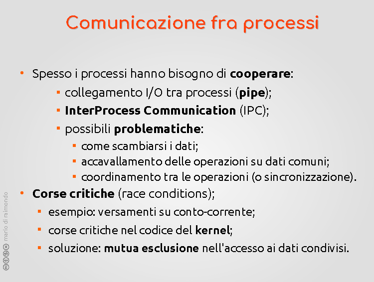

# SISTEMI OPERATIVI - 6

Riprende la discussione sui Thread. Un thread è caratterizzato da PC, registri, stack, stato. Condivide tutto il resto, e non possiede protezione di memoria.  
--> SCHEDULING dei thread.  
--> Cambio di contesto più veloce
(etc)  

---

## Programmazione multicore

una singola applicazione se scritta su più threads (se l'applicazione lo incoraggia) può avere vantaggi sulla computazione/efficienza della macchina stessa. Cosa succede se una singola applicazione è divisa in 4 threads?



--> su più cores, il lavoro viene svolto nella metà del tempo perché può avvenire una suddivisione più efficace e efficente.

-> Quali sono i costi della programmazione multicore?  
E' compito del programmatore adattare il programma per sfruttare il modello a thread (vedi laboratorio)(come ids??) --> Primo step: separare le tasks che possiamo pensare nell'applicazione. ad esempio: In un wordprocessor abbiamo la gui, il correttore ortografico, il caricamento da file e salvataggio, etc.  
Devono essere bilanciati rispetto ai propri compiti (se una task runna per tutto il tempo in cui l'applicazione è up allora più importanza?)  
->Nel cercare di definire un task bisogna crearli di dimensioni quanto più simili possibili.  
Non sempre a un task corrisponde un thread però.  

suddivisione e DIPENDENZE dei dati (tracciamento delle dipendenze) individuazione dei vincoli di ciò che serve, importante per coordinare le azioni. --> Interprocess comunications.  

-->Cosa può andare storto nelle applicazioni (---condivise?)  

**Dipendenze tra processi stessi**  ->  dipendenze logiche tipo merge e mergesort.  

Esempio -> Due thread sulla stessa struttura dati, es. un buffer. Modello produttore/consumatore dove un thread mette dati su essa e un altro li estrae.  
Attenzione ai problemi di comunicazione e sincronizzazione. Se non si coordina non si può andare avanti. Problema di "addormentare" i consumatori e "svegliarli" al momento giusto. Problema di spazio per le strutture dati fisse come gli arrays, per il produttore.  

**Test e debugging**  -->  Modello meno lineare e più complicato. Forzare le interazioni ad interfacciarsi in comportamenti desiderati (raised conditions?)  

---

## Modello thread a livello utente  



Il primo approccio al modello thread. Il sistema operativo conosceva solo i processi, prima. In ambiti particolari si usa ancora. Si implementano i thread al livello utente, all'interno del processo. In alcuni libri di testo è chiamato 1-a-molti. Per associare molti task ad un singolo thread (dentro un processo). Sfruttando le capacità della CPU che ho.  

Teoricamente questo vuol dire che ognuno dentro il processo può creare i propri thread ma è un processo molto delicato e si preferisce o rely su qualcuno che l'ha fatto per noi o usare librerie che possono  definire processi di tipo thread (altrimenti dovrei lavorare con l'assembly e ciò Non Ci Piace).  

Il kernel vede il processo nella sua interezza come un flusso,  e l'applicazione al suo interno fa un subaffitto della cpu (virtuale) a sua disposizione.  

Come si fa a salvare lo stato della CPU, se questo gira su livello utente? entra in gioco la operazione (thread yield??) --> Si cede la cpu virtuale al runtime environment e questo salva i registri (su cui posso mettere mano) che trova all'interno della thread table dentro il proprio processo stesso (dentro il runtime system) e tutti i valori dei registri ordinari vengono salvati utilizzando operazioni ordinarie. Il runtime environment farà finta di essere un sistema operativo e dovrà operare un sotto problema simile allo SCHEDULING tra i thread che ha all'interno. Sub-problema.  

### ---> Contro del thread a livello utente  

--> Questo modello è lontano dal non-bloccare-i-suoi-fratelli-se-si-blocca. Questa richiesta da parte del processo è una syscall. Nel bloccare il processo P si bloccano anche tutti i threads al suo interno.  
Vanifica la maggior parte dei pro dei threads, in questo modo. Questo problema del bloccaggio è stato mitigato attraverso strategie (esempio: strategie rispetto a richieste bloccanti).  

--> **Select**, per evitare che un thread si blocchi davanti a una richiesta potenzialmente bloccante. Un ciclo simile a un busy waiting. (E' uno spreco della CPU.). Altro aspetto negativo = devo inserire nuove informazioni in modo da far funzionare il modello e adattarlo allo scenario di thread a livello utente.  

--> **page fault** -> Quando gestendo attraverso memoria virtuale, dato che non risiede tutto effettivamente nella RAM, riusciamo a eseguire applicazioni che assieme sarebbero troppo grosse per girare assieme. Parcheggiamo parte della roba su disco in maniera che i processi non se ne accorgano; questo lo fa il sistema operativo stesso. Quando l'hardware si accorge del trucco (è un evento e non un errore) lo comunica al software e la gestione della pagefault implica un blocco/lentezza. Fino a quando la gestione non viene completata il flusso di codice che ha fatto partire l'evento è bloccato. L'operazione poi si ritenta -> e il page fault sarà risolto.  
Questa è una forma di bloccaggio del codice asincrono. Non viene chiesta una chiamata di sistema, è una fetch semplice ma a causa del meccanismo della memoria virtuale viene causato un blocco nel flusso. Nel modello thread utente questo viene gestito dal kernel al livello di processo e si blocca l'intero processo.  

**PRO** -> Efficienza e minimo overhead nella gestione dei threads. Meno complessità. Il più veloce tra i context switch che vedremo.  

classifica context switch (in termini di efficienza e overhead introdotto):  

1) Thread fratelli all'interno dei thread utente  (tutte le operazioni non passano dal kernel)
2) Thread fratello (thread kernel) imparentati parte dello stesso processo)(programmazione MMU?)
3) Processo - Processo (thread non importante)

---

## Thread a livello kernel  


- Detto anche modello 1-a-1

-> gestione di prima mano da parte del kernel, e una chiamata bloccante blocca solo uno dei threads. Blocco transitorio e molto rapido, gli altri non hanno intoppi. Il contro: Il context switch è più lento ma comunque più rapido dei processi da soli.  
La tabella dei threads viene spostata all'interno del kernel, come anche la tabella dei processi che rimane nel kernel.  
La creazione degli oggetti processo (pensare fork clone) è più pesante di creare un thread, anche in modalità kernel. Creare un thread è circa 100 volte più veloce di creare un nuovo processo (sic, Di Raimondo). Come anche distruggere un processo. Ha comunque un costo: applicazioni che sono pesantemente multi-thread (esempio: webserver); esso  potrebbe usare un modello thread-worker. Un numero prefissato di workers, che parcheggio e riaddormento. Non creo e distruggo, risparmiando sui costi di creazione e distruzione. Il numero di workers è parametrico: si decide a priori dall'amministrazione, in modo che siano abbastanza.  

---> Unix e (h)ex(t)ec(h). nope  

---

## Modello Ibrido  


Detto anche "molti-a-molti".  

Modello in cui si prova a mettere assieme i due modi in modo da trarne vantaggio. Sfrutta il fatto di avere thread multipli all'interno del kernel e anche il bisogno di avere più task all'interno della mia applicazione. Il modello ibrido parte dal fatto che, se posso assegnare una task a un thread oppure un solo thread kernel e sfruttarlo per gestire molte tasks. Prevede un certo numero di thread del kernel. Ognuno di essi viene assegnato ad un certo numero di thread utente (eventualmente uno). L'assegnazione viene decisa dal programmatore.  

Contro: Complica l'organizzazione e bisogna gestire la coesistenza di più tasks all'interno di un singolo thread.  

Vantaggio: Alcuni dei tasks in fase di progettazione possono non aver bisogno di indipendenza e magari non vogliamo un nuovo thread solo per quel task. Ad esempio -> Tb Tc Td possono coesistere all'interno dello stesso Thread Kernel accettando i contro che avremo (ovvero il fatto che se uno si blocca si bloccano anche gli altri) ma ci può andare anche bene in certi casi. Ad esempio, i tasks relativi alla gui possono essere indipendente (non vogliamo che si blocchi) quindi gli diamo un thread kernel dedicato; ma gli altri kernel possono essere input-output su disco per un salvataggio, e lo posso fare coesistere con il correttore ortografico. Posso fare interrompere il correttore e farlo coesistere con l'IO su disco non è un problema.  

---

## I thread  nei sistemi operativi  


su linux l'idea di processo è stato generalizzato in un "Task" (diverso da quello di cui abbiamo parlato finora) un Task sotto linux può essere chiamato e questo clone è simile alla fork ma è modulabile; posso creare un nuovo flusso/task e decidere che cosa avrà in comune con il suo task padre e cosa no. Granularità molto dettagliata. Gli estremi di questa granuralità praticamente arriva dalla fork alla Create di windows. Volendo può creare ibridi (ma in realtà anche no).

Librerie PThreads (di Posix, ma compatibile anche con MacOS e Windows).  

Rust, Go, C#, possono essere usati per lavorare con i threads (sintassi dei linguaggi stessi)

---

## **COMUNICAZIONE FRA PROCESSI**



A prescindere dalla loro parentela i processi sono separati. Come farli comunicare: InterProcess Communication(IPC).  

--> Modello input-output. I processi in realtà hanno modelli di comunicazione standard. Canali di input, output, errori. Ogni processo appena lo creiamo ha questi 3 canali di comunicazione.  

-Input--> P1 --Output->  
.......................'--Errore->  

Principio base dei sistemi UNIX.  
I canali hanno associazioni/assegnazioni standard.  
--> Input <-> tastiera  
--> Output <-> terminale stesso  
--> Errore <-> terminale stesso  

Esempio di comunicazione: ```pipe``` sul terminale linux.
$ cat lista.txt | grep parola  
$ cat lista.txt | sort ______  
$ cat lista.txt | grep  parola  | sort _______  

la shell creerà due processi e farà sì che i due processi siano in comunicazione. "Collegamento idraulico".  

Interprocess Communication -> c'è un vero e proprio parallelismo; coordinazione dei tre processi.  
Buffer intermedio tra i processi/comandi. Eseguiti in parallelo e coordinati tra i rispettivi input.  

Esempio di produttore-consumatore con buffer intermedio. In realtà il modello input-output viene gestito in modo naturale tramite il bloccaggio delle relative chiamate.  

E' adatto solo ad alcuni scenari perché il consumatore non  può interpellare il produttore. Non si possono scambiare i dati.  

Finestre e pezzi di memoria comune per scambiarsi dati coordinarsi e comunicare. Questo modello è quello che succede con i threads. Coincide a quello.  

PROBLEMI: accavallamento delle operazioni. Per evitarlo ho bisogno di sincronizzare: servono strumenti di coordinamento.  

( ---- )  

Esempio conto corrente; versamento su una variabile.  
Poi versamento da un altro processo, ciclo di n iterazioni, etc.  
Problemi sorgono quando i due processi avvengono ""contemporaneamente"".  

Alcuni flussi che hanno strutture dati in comune sono problematici da intervallare fra di loro/alternare.  

SEZIONI CRITICHE: Strumenti tali da fare in modo che nessun processo entri nella sezione critica se ce n'è già uno lì. 