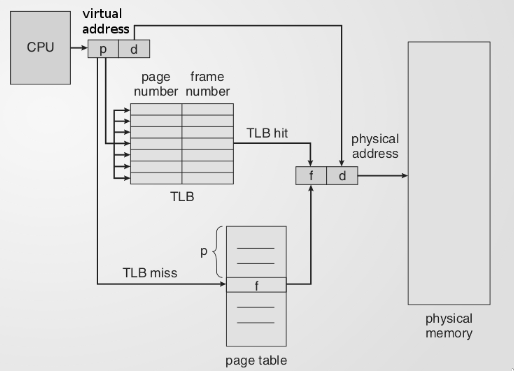
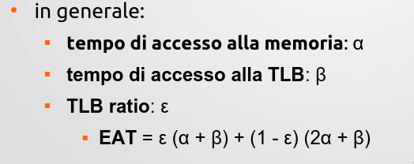

# 14 Lezione -- Sistemi Operativi
  
--- 

<!-- TOC -->
- [Recap -- Tabella delle pagine](#recap----tabella-delle-pagine)
    - [Bit di Referenziamento](#bit-di-referenziamento)
    - [Bit per disabilitare la cache](#bit-per-disabilitare-la-cache)
    - [Bit di validita' o allocazione](#bit-di-validita-o-allocazione)
- [Tabella dei frames](#tabella-dei-frames)
    - [Progettazione di una tabella delle pagine](#progettazione-di-una-tabella-delle-pagine)
    - [Memoria associativa  / TLB -- translation lookup buffer](#memoria-associativa---tlb----translation-lookup-buffer)
        - [Come evitiamo l'azzeramento della TLB al context switch?](#come-evitiamo-lazzeramento-della-tlb-al-context-switch)
    - [Effective Access Time (EAT)](#effective-access-time-eat)
- [Tabella delle pagine multilivello](#tabella-delle-pagine-multilivello)
<!-- /TOC -->

---

## Recap -- Tabella delle pagine 
Tabella delle pagine --> Una per ogni processo. Una mappatura delle pagine dello spazio di indirizzamento del singolo processo.  
Com'e' organizzata una tabella delle pagine --> Soprattutto quando gli spazi di indirizzamento sono molto grandi.  
--> Singole voci di una tabella delle pagine. Chiave di ricerca: numero di pagina virtuale --> e l'offset che dice la posizione della pagina dell'informazione che mi serve.  
Per consultare questa tabella --> prima vediamo SE e' presente e DOVE  
**Tabella delle pagine** --> Mappatura parziale  ?? (de che?) e bit di presenza e assenza
**Specifica di protezione lettura/scrittura** eventuale esecuzione
**Bit modificato**/**Dirty Bit**  --> Un flag che indica se la copia portata in ram e' ancora identica a quella sul disco. Viene mantenuto se la memoria non viene acceduta con scrittura e viene cambiato dalla MMU se si effettua una operazione di scrittura sulla pagina in questione.  

### Bit di Referenziamento 
Simile al bit di modifica ma con riferimento alla generica azione di referenziamento. O lettura o scrittura; se la pagina e' stata usata. C'e' un caso in cui da 1 va a 0? Viene usata (dalla MMU) come una statistica di breve termine; se gestito in una buona maniera permette di avere una statistica semplice e elementare sul breve termine su quali pagine vengano usate. Si azzerano periodicamente quelle di tutte le pagine del processo. La frequenza di azzeramento e' molto breve. Se prima di azzerare controllo --> Il bit da' informazione di, se quella pagina sia stata usata o meno, riferita all'ultimo periodo. Non dice quanto, ma possiamo distinguere quelle che non sono usate neanche una volta. Puo' essere considerato importante perche' lo gestisce la MMU e viene "regalata" dall'hardware al software. Questo tipo di tracciamento/statistica normalmente sarebbe molto dispendioso soprattutto se piu' significativo a causa dell'overhead di tenere aggiornata la statistica. Gestita in maniera semplice e' utile. L'ultimo periodo e piu' recente (100/200 millisecondi) hanno un valore prezioso --> Un tipo di valutazione che e' alla base anche dell'RRU (Cache) secondo cui quelle piu' recenti saranno probabilmente piu' utili nel futuro molto prossimo.  
Strumento per predire cosa fara' il processo e quali sono le pagine utili da tenere in memoria. Molti algoritmi di sostituzione delle pagine in memoria sono basati su questo bit di referenziamento.  

### Bit per disabilitare la cache  
Potrebbe essere utile  
  
Come dialoga il driver con il controller? GOOD FUCKING LUCK-  no okay. esistono modi. Credo. Oops  
  
Idea di mappare le IO su alcuni indirizzi di spazi di indirizzamento cosi' quando il processo fa delle fetch o store su alcuni indirizzi cio' viene mappato --> eseguito su porte di controller (operazione di mappatura e' privilegiata ma viene fatta una tantum con riferimento a specifiche porte e cose) e in questa ottica il ruolo della cache puo' anche essere controproducente. Non sto facendo cache --> serve a limitare accesso alla RAM ma nell'informazione che sto nascondendo e' lo stato del registro non va bene.  
  
### Bit di validita' o allocazione  
  
Individuazione spazi utili e vuoti di allocazione all'interno dei processi dove lo stack e l'heap possono crescere --> il sistema operativo puo' fare chiamate per dire di allocare etc. Ogni pagina viene marcata con bit di allocazione se e' usata. Quelle vuote hanno quel bit nullo.  
  
Non si puo' fare un riferimento o accesso ad una pagina con bit di validita' nulla perche' quella zona di memoria non e' stata data al processo. Corrisponde alla segmentation fault o eccezioni/errori/istruzione non valida.  
  
Per alzare l'asticella dello spazio di indirizzamento dell'heap rispetto allo spazio vuoto chiedo al sistema operativo: cosi' i bit di allocazione viene messo a 1 ed e' possibile utilizzare quello spazio per le pagine dell'heap.  
  
## Tabella dei frames 
Ce n'e' solo una, mappatura di una risorsa globale.  

Tabella che tecnicamente ha tante voci quanti sono i frames (determinare anche quanta RAM ho). Tenere traccia dello stato di occupazione di ogni frame fisico. Stato: occupato/libero. Se occupato: da quale processo?   
Viene consultata: quando viene creato un nuovo processo per creare la tabellla delle pagine di quel processo; se l'accesso provoca un page fault vuol dire che l'informazione utile si trova nel disco, quindi in ogni caso devo portarlo in memoria. Lo stato fortunato e' che almeno un posto e' libero dove posso mettere quel processo.  
Un frame che prima era libero diventa occupato nella tabella dei frames. Devo anche aggiornare la tabella delle pagine --> Allocare le pagine che prima erano libere (bit di allocazione messo su allocato/valido). etc. L'istruzione che ha provocato il pagefault viene reiterata e sta volta dovrebbe fare page hit.  
Ogni volta che un processo chiede di allocare nuove pagine.  

### Progettazione di una tabella delle pagine  
  
Aspetti principali : velocita' della consultazione e dimensione.  
Scenario: attimo prima: CPU gestisce codice di P1 all'interno dello spazio di indirizzamento.  
Processo 2: altro processo con cose sue e dati etc.  
Ci sara' una tabella delle pagine di p1 e una tabella delle pagine di p2. L'unica CPU lavora su uno, quindi deve fare context switch (cambio di contesto) --> A fianco della CPU lavora la MMU. Nell'effettuare il contesto fino all'attimo T uso la tabella P1, all'attimo T+1 devo utilizzare la tabella di P2.  
Come effettua il cambio di tabella?   
Nei primi sistemi la tabella era caricata sui registri della MMU tanti quante erano le voci della tabella. --> quindi e' il caso in cui abbiamo un numero sufficiente di registri su cui caricare l'intera tabella
Oppure abbiamo un riferimento = Dove sta la tabella delle pagine da usare --> Registro delle pagine da usare (Page-Table Base Register (PTBR)).  Tabella interamente  residente in memoria con riferimento fisso che sta in una parte nella RAM e la tabella deve essere contigua, e non la posso spezzettare in memoria come le altre cose (altro problema).  
  
Quando si fa il context switch --> cambiamo questo registro. E' piu' facile, costa meno di ricopiare tutta la tabella ma adesso devo fare due accessi alla memoria per decodificare l'indirizzo e prelevare un dato.  
Il throughput traverso cui accedo alla RAM si dimezza.  
Sembra un prezzo alto ma gli accessi possono essere anche tanti --> Quindi ?  
Ci sono tecniche e escamotage per poter rendere piu' interessante tutto questo.  

Con la tecnica PTBR se ci sono due processi sulla stessa CPU non devono per forza essere imparentati perche' possono lavorare su riferimenti di tavola delle pagine diverse perche' quest'ultima non e' direttamente caricata in memoria. 
   
Chiave di ricerca: N di pagina virtuale  
Da dove si sviluppa : Messo nella tabella delle pagine  
  
### Memoria associativa  / TLB -- translation lookup buffer
 

[wiki Translation Lookaside Buffer](https://it.wikipedia.org/wiki/Translation_Lookaside_Buffer)

Uso di memoria associativa o Translation Lookaside Buffer --> memoria speciale; corrisponde a un certo numero di voci ad accesso ultraveloce all'interno dell'MMU.  
Contiene la copia quasi speculare di alcune voci della tabella delle pagine piu' utilizzate; questo tipo di registri speciali sono pochi e costosi; non copro l'intera tabella delle pagine ma alcune pagine fortunate le posso mettere nella TLB.   
  
Quando la CPU genera un indirizzo virtuale utilizzerebbe un numero eteriuhgkfdgh  
qui invece la MMU prima ancora di fare l'accesso alla tabella consulta la memoria associativa e chiede se c'e' la voce di questo numero di pagina (molto veloce).  
Indicizzata per numero di pagine virtuali.   
  
Se si e' nel caso fortunato --> TLB HIT allora ok. Le informazioni che normalmente troverei nella tabella delle pagine nella RAM le trovo nella MMU direttamente e l'accesso della TLB e' molto molto veloce rispetto all'accesso alla ram. Riesco a effettuare la traduzione dall'indirizzo virtuale all'indirizzo fisico senza accedere alla RAM. Quindi invece di fare Accesso alla RAM + Accesso alla RAM, faccio Accesso alla TLB + accesso alla RAM. Meglio    
  
A differenza della tabella delle pagina che ha un record per ogni pagina, la TLB contiene solo alcune pagine quindi dovrei vedere una per una per vedere se c'e'. Sarebbe lineare, ma l'Hardware prevede una specie di ricerca parallelizzata (non lineare) se c'e' un match.  
  
La singola voce contiene una serie di voci in certi modi diverse ; voci che mi aspetto all'interno della generica table -> Prima battuta, il numero di pagina virtuale.  
Qui c'e' una copertura a chiazze --> Prima voce sara' la chiave di ricerca (numero pagina virtuale). Seconda cosa: Numero di frame. Non c'e' il bit di presenza/assenza.  
La TLB funziona come una cache, tiene traccia delle **piu' utilizzate**; **se e' nella TLB una pagina** e' stata usata da poco quindi deduciamo che **sia presente in RAM**.   
  
Le altre voci: 
* **bit di validita' della voce della TLB** 
Serve a riconoscere le voci piene e vuote della TLB.  
* **Codice di protezione** 
* **Dirty Bit** 

Ci sono le informazioni minime per accedere alla pagina quindi.  
Ci sono perche' devono essere considerate quando la MMU gestisce la richiesta per la CPU. La maschera dei permessi e' una copia di quella delle pagine e deve essere presente perche' la MMU non puo' prevedere la configurazione dei permessi di quella pagina.  
Il bit di modifica e' per una ragione di efficienza copiato dalla tabella delle pagine.  La questione e' che i successivi accessi potrebbero mutare questo valore (se faccio uno store la MMU deve modificare il dirty bit lo aggiorna nella TLB e non la tabella delle pagine.) Quando la TLB scarta quella voce deve anche aggiornare il dirty bit nella copia nella RAM.  
O deve svuotare la TLB (tutto deve essere aggiornato) oppure una generica voce deve essere scartata perche' la TLB si riempie e il SO ha il compito di individuare la voce piu' sacrificabile e levarla dalla TLB.  
Manca il bit di refenziamento (implicitamente a 1)  
  
**Dovrei azzerare la TLB al momento del context switch**--> perche' stiamo facendo come indirizzamento la pagina virtuale. Ammesso che siano entrambi mappati lo saranno su frame diversi e se teniamo le voci della TLB del processo di prima useremo i dati del processo di prima. Aberrante  
  
#### Come evitiamo l'azzeramento della TLB al context switch?  
Accoppiamo il numero di pagina virtuale ad un identificativo univoco del processo a cui si riferisce quella voce. Insieme queste due voci rappresenteranno la chiave di ricerca. Permette di distinguere pagine virtuali diverse. Quanto piu' e' grande la TLB quanto piu' posso sperare di tenere voci che sono anche di altri processi a parte quello attuale in esecuzione.  
  
### Effective Access Time (EAT)  
  
Esempio: Accesso alla memoria  
RAM = ipotizziamo 100nsec
Accesso alla TLB = 20nsec  
* Tempo effettivo di accesso:  
120 nsec per TLB Hit  
220 nsec per TLB Miss   
Ipotizziamo un TLB ratio (percentuale di successi) dell'80%  
* Tempo medio effettivo di accesso: 0.8 x 120 = 0.2 x 220 = 140 nsec  
  
  

---

## Tabella delle pagine multilivello  
Approccio gerarchico multilivello per la rappresentazione della tabella delle pagine in sistemi con molta RAM  
Esempio di indirizzi virtuali a 32 bit (Pentium) --> 1mil di pagine da 4kb. Suddividiamo queste voci in gruppi da 1024 byte.  0-1023, 1024-2047 etc. suddivido in gerarchie: Prima ho una tabella delle pagine di primo livello con 1024 voci in cui ognuna non e' una tabella classica ma punta all'indirizzo fisico di una tabella di secondo livello.  
L'idea e' di non mantenere tutta la tabella in memoria e non devo allocare l'intera tabella delle pagine  
Non e' neanche detto che sia tutta rappresentata sulla RAM.  
TOT kb invece di 4 MB fissi. Ci piace  
  
Sembra almeno risparmiare memoria ma ci sono dei contro.  
  
Il contro di questa flessibilita' e' legata alla complessita' della consultazione.  
Prima individuo in che gruppo sono e all'interno del gruppo individuo qual e' la voce che mi interessa. Divido (in questo caso) per 1024 -->  p/1024 --> risultato lo chiamo pt1, il resto e' il pt2  
  
La parte alta --> pt1 (dividendo per la cardinalita' del gruppo --> ad esempio 100 / 1024 fa 0 con resto di 100 ovvero gruppo 0 voce 100. Funziona. Con i moduli)  
  
Pt1 (quoziente) indica l'indice del gruppo e Pt2 (modulo/resto) indica la voce all/interno di quel gruppo  
devo moltiplicare x 4 byte (grandezza della word)  
Fetch -->  
  
Usare una tabella gerarchica --> aggiunge un accesso alla memoria. Con una architettura 64bit arrivano fino a 5 livelli usando trucchi e casini. 4 Accessi solo per fare la traduzione + l'accesso in se'  
  
Queste tabelle sono compatibili con la TLB anzi. Sono importantissimi i tempi perche' si allungano un sacco con questo accesso lungo alla memoria.  

La TLB non viene cambiata perhce' usiamo comunque Pt1 (quoziente) e pt2 (resto).    
  
Non e' detto che i 20 bit siano tutti a meta' ma avere pt1 da 9 bit e pt2 da 11 bit. Quindi avere 512 gruppi e avere per ogni gruppo 2048 voci.  
  