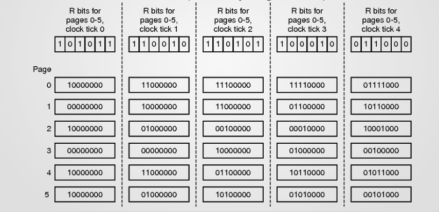

# 15 Lezione -- Sistemi Operativi 

---
<!-- TOC -->
- [Tabella delle pagine invertita](#tabella-delle-pagine-invertita)
- [Caches](#caches)
    - [Caches della memoria vs Memoria virtuale](#caches-della-memoria-vs-memoria-virtuale)
        - [Basata sugli indirizzi fisici](#basata-sugli-indirizzi-fisici)
        - [Basata sugli indirizzi virtuali](#basata-sugli-indirizzi-virtuali)
- [Algoritmi di sostituzione delle pagine](#algoritmi-di-sostituzione-delle-pagine)
    - [Algoritmo Ottimale (Algoritmo OPT)](#algoritmo-ottimale-algoritmo-opt)
    - [Algoritmo NRU (Not Recently Used) -- A quattro classi](#algoritmo-nru-not-recently-used----a-quattro-classi)
    - [Algoritmo FIFO](#algoritmo-fifo)
    - [Algortimo della Seconda Chance](#algortimo-della-seconda-chance)
    - [Algoritmo Clock](#algoritmo-clock)
    - [Algoritmo LRU (Least Recently Used)](#algoritmo-lru-least-recently-used)
    - [Algoritmo NFU (Not Frequently Used)](#algoritmo-nfu-not-frequently-used)
    - [Algoritmo di Aging](#algoritmo-di-aging)
<!-- /TOC -->
---

## Tabella delle pagine invertita 

Invertita nella struttura di indicizzazione. La struttura e' come quella della tabella dei frames.  
Versione "arricchita": abbiamo un record per ogni frame. Questo tipo di struttura prevede informazioni nei propri frame rispetto alla tabella delle pagine --> Metto come chiave di ricerca una chiave che identifica il contenuto univocamente. Questa tabella e' unica e globale. Visione di cio' che e' contenuto all'interno della RAM fisica. Il numero di pagina e' equivoco se non sappiamo di che processo si parla. QUINDI mettiamo anche il PID.  

1. Numero di pagina 
2. PID

Dentro un record ci sara' messo R, W, Protezione... non il bit di presenza/assenza (perche' sara' a uno comunque se il record e' presente all'interno della tabella delle pagine invertita.)  
Dall'indirizzo virtuale recuperiamo il numero di pagine.  
Il frame e' l'indice della tabella delle pagine invertita.  
Se non trovo occorrenza all'interno della pagina c'e' un match fault (non e' in RAM).  
Ho barattato quindi n tabelle con una. ? Sostituisce tutte le tabelle di prima con una ma ...
  
I due gruppi di strutture non sono equivalenti in termini di informazioni.  
Nella tabella delle pagine esistenti riporta tutte le pagine esistenti anche quelle parcheggiate su disco, mentre quella invertita se non e' in un frame non e' rappresentata li'.  
Page Fault --> Bisogna usare le tabelle per processo

La chiave di ricerca --> E' lineare. Perche' come chiave di ricerca sono due elementi (che dovrei fare ad ogni accesso). E' comunque compatibile rispetto alla TLB ovvero, la TLB funziona come una sorta di cache per questa struttura, grazie al cielo.  

La dimensione di questa tabella e' proporzionale alla memoria fisica della RAM.  
Ricerca lineare improponibile --> Per fortuna ci sono modi per cercare piu' velocemente, per esempio una tabella Hash che rappresenti questo tipo di record a seconda di un tipo di chiave.  
Il costo viene ammortizzato e abbassato.  

La tabella invertita quindi combinata con la TLB e' promettente ma ad un certo punto e' stata dismessa perche' sono sorti altro tipo di problema (vedi: aliasing). Adesso si usano strutture a tabelle gerarchiche con vari trucchi per andare piu' veloce.  
  
## Caches
  
### Caches della memoria vs Memoria virtuale  
  
La cache della memoria puo' essere 
  
#### Basata sugli indirizzi fisici

Cache messa dopo la MMU.  
  
[ CPU ] <--> [ MMU ] <--> [ **Cache** ] <--> [ Memoria DRAM ]

Questa cosa funziona ma ha un problema: prima di capire se la cache puo' velocizzare l'accesso ho tanto da fare. E' un collo di bottiglia che inficia l'efficacia di una cache del genere. Caching meno efficace.  
Da un processo all'altro pero' continua a funzionare anche dopo il context switch!!!  Non bisogna invalidarla.  

#### Basata sugli indirizzi virtuali
  
Cache messa prima della MMU.

[ CPU ] <--> [ **Cache** ] <--> [ MMU ]  <--> [ Memoria DRAM ]  
  
Indirizzi virtuali. Arriva la richiesta dell'indirizzo virtuale, andiamo a cercare --> informazione torna subito. Se c'e' il cache miss allora si chiede alla MMU etc.  
La parte lunga e' legata all'evento meno frequente. Ogni MB basata su indirizzi virtuali e' piu' efficiente di quella basata su indirizzi fisici. Pero'! Ogni linea di cache e' etichettata su un indirizzo virtuale. Bisogna annullare tutta la cache quando si attua il context switch. Siamo costretti ad azzerare quando si passa all'altro processo. Lasciare le informazini nella cache non solo non serve a niente ma e' anche pericoloso/fa confondere. Se cerco a partire di (Asid/pid e indirizzo virtuale), non devo azzerarlo pero'. Questo metodo di indicizzazione pero' questo diventa molto costoso da implementare e la ricerca al suo interno diventa peggiore.  
  
Magari una cache basata su indirizzi virtuali piu' piccola oppure piu' grande ma con un tradeoff.  
  
Le cache L1 sono quelle piu' vicine alla CPU e vengono poste prima della MMU in maniera che essa non crei colli di bottiglia e sono basate su indirizzi virtuali. Le cache di secondo e terzo livello (L2, e successive) invece sono poste dopo la MMU e funzionano per indirizzo fisico. Permette di non doverle azzerare ma hanno la MMU che fungono da collo di bottiglia. La MMU si appoggia sempre comunque alla TLB! Quindi velocizza un po'. Ci sono delle tecniche che permettono di rendere piu' efficiente questo processo.  
  
* Id della linea di cache  . Parallelismo pseudo forzato in base alla paginazione degli indirizzi virtuali che permea tutto il sistema software del sistema operativo (Frasi che non sono nella bibbia).  
  
---
  
## Algoritmi di sostituzione delle pagine  
  
In caso di page fault e in assenza di frames liberi e' necessario scegliere una pagina vittima.  
Come sceglierla?  
Problema di gestione della cache.  
Bisogna trovare uno slot libero, soprattutto --> Priorita' di portare un frame nella memoria fisica perche' sta fermando un processo.  
Se scelgo bene un processo da memorizzare posso mitigare questo disservizio (memoria tolta ad altri processi)  
Algoritmi di sostituzione delle pagine, sono algoritmi di scelta come gli algoritmi di scheduling. Qui la metrica a parita' --> Meno page fault riesco a creare meglio e'.  
  
La logica e' :bat: :hong_kong: :ophiuchus: . Oops  
  
### Algoritmo Ottimale (Algoritmo OPT)

La logica effettiva e': Scegliere la pagina che verra' richiesta piu' lontano nel futuro.  
Ottimale ma difficilmente realizzabile --> Non abbiamo sempre quel tipo di informazioni.  
Ma da' comunque una idea su quello che bisogna fare.  
  
### Algoritmo NRU (Not Recently Used) -- A quattro classi
Algoritmi eseguiti dal sistema operativo.  
Anche l'efficienza della scelta e' importante.  
Raccogliamo un po' di statistiche sull'uso delle pagine caricate 
* Bit di referenziamento e di modifica
    * aggiornati tipicamente gia' in hardware e non spreco cicli
    * Azzerati dall'SO (quello di referenziamento periodicamente)
Per ogni pagina candidata ad essere scartata ho questa copia di bit (Referenziamento e Modifica)
E baso la scelta su questi due valori. Immagino di classificare e partizionare tutto in base a queste 4 classi a seconda dei due bit.  
  
0 0 -- *Non referenziato*, *non modificato*  
0 1 -- *Non referenziato*, **modificato**  
1 0 -- **Referenziato**, *non modificato*  
1 1 -- **Referenziato**, **Modificato**    

---

### Algoritmo FIFO 
Considerare l'ordine di arrivo in RAM e quello piu' vecchio cerchiamo di scartarlo.  
Viene rimossa la pagina piu' vecchia  
Scelta non sempre felice: si rimuovono pagine vecchie ma magari molto usate. 

### Algortimo della Seconda Chance  
Modo per "aggiustare" il FIFO  
Si tiene conto dell'attuale stato del bit R.  
Viene rimossa la pagina piu' vecchia se non usata di recente.  
Si combina il FIFO con l'uso. 
Prima chance: porto il bit di referenziamento a 0
Procede cosi' fino a quando non trovo il bit di referenziamento a 0. Quella la scelgo e la butto in disco  
  
### Algoritmo Clock
Implementazione ottimizzata dell'algoritmo della seconda chance, cambia il modo in cui viene implementato. Quando faccio una "Grazia" prima faccio una rimozione e un inserimento. Qui faccio una coda circolare in cui la catena e' chiusa e il criterio e' ancora quello di arrivo FIFO.  
  
### Algoritmo LRU (Least Recently Used)  
Concetto: le pagine piu' usate di recente lo saranno anche in futuro.  
Idea: rimuovere le pagine meno usate di recente.  
Nella fase di vita piu' vicina il processo utilizza un gruppo di informazioni limitato, un sottoinsieme di tutte le informazioni che compongono il codice, come anche un sottoinsieme delle strutture dati e le variabili. (Principio di localita' dell'esecuzione del codice). Questi dati utili se sono stati usati di recente allora probabilmente di conseguenza saranno utili nel breve futuro. Locale nel breve periodo. L'algoritmo ottimale cosa suggerisce? Di scegliere le pagine piu' in la' nel futuro (che pero' non conosco).  

Pero' le direzioni di scelta dicono che se non posso etichettare le cose nel futuro molto lontano --> se vado a preservare questo tipo di utilizzo ??? andra' a scegliere la pagina usata meno di recente.  
C'e' una simmetria del passato recente rispetto al futuro recente quindi se e' usata nel passato piu' remoto --> Sara' usata lontanamente nel futuro ?????  
Implementandolo dovrei fare una sorta di etichettatura delle pagine in memoria e usare un timestamp per ognuno. --> Timestamp realistico e tracciare il passato. Solo che e' un tracciamento legato a un utilizzo ????  
Avendo un etichettamento di questo tipo scelgo la pagina con l'etichettamento piu' vecchio.  
  
Posso implementarlo con una coda --> ogni nodo e' una pagina e nella posizione di testa (posizione piu' sfortunata) ho la Least Recently Used page e in coda ho la Most Recently Used Page. Un semplice accesso ad una pagina puo' mutare questo ordine. --> Estrarre il nodo della coda e inserirlo nella posizione migliore.  L'algoritmo va sempre a guardare alla testa (posizione peggiore) per cosa levare. E questo lo devo fare per ogni accesso alla memoria.  

Se questa struttura fosse gestita via software sarebbe una roba ingestibile da aggiornare con una frequenza allucinante.  

Come si implementa? In hardware con le cache me lo posso permettere, cosi' come se mi aiuta l'hardware. Ma anche usare il timestamp e' problematico. Se esiste una tabella per ogni pagina in memoria per il timestamp dovrebbero essere aggiornati ad ogni accesso alla memoria. Come fare?  

Se per ogni frame pieno avessi un contatore? Immagino dei contatori che non traccino il tempo ma le istruzioni. Se ho nella CPU un contatore incrementato ad ogni istruzione eseguita/ciclo di clock. La gestione e il tipo di aggiornamento che mi aspetto (gestito dall'hardware) diventa piu' semplice.  Ogni volta che accedo ad una pagina il contatore viene ricopiato nella voce della pagina a cui viene acceduto.  
Vado a scegliere la pagina con il contatore piu' basso quando devo scegliere che pagina levare : implemento l'LRU.  
Fra le implementazioni la LRU e' quello piu' ottimale.  
  
### Algoritmo NFU (Not Frequently Used)
Una implementazione perfetta dell'LRU: Pensiamo ad una sua approssimazione.  
Abbiamo un contatore in ogni voce della tabella delle pagine e periodicamente il valore del bit R prima di essere azzerato viene sommato al contatore.  
Viene controllata e rimossa la pagina con il contatore piu' basso.  
Ho un contatore C per ogni pagina -> Cumulo di bit di referenziamento.  
  
Problema: Potrei lasciare una pagina molto usata in passato e scartare una pagina arrivata da poco che invece sara' molto utilizzata.  
  
### Algoritmo di Aging  
Ad ogni scadenza del clock : 
1. **Shifto a destra** del contatore associato ad ogni pagina
2. Accostamento a sinistra (come bit piu' significativo del bit R).  
Il criterio rimane identico: Li' dove l'algoritmo viene chiamato a scartare qualcuno viene scelto l'algoritmo con il contatore piu' piccolo. Perche' e' una idea migliore?  
  
1. E' fattibile? Si'. Prevede gli stessi aggiornamenti dell' NRU  

Quindi eventi recenti hanno piu' peso rispetto ad eventi passati! Bene  
Rappresenta una specie di Log dell'utilizzo.  
  
Considero non piu' solo la quantita' ma l'ordine e la priorita' degli 1.  
Approssima l'LRU perche' va a posare positivamente cicli recenti e a dimenticare mano mano gli eventi piu' remoti.  
Considero la colonna dei bit piu' significativi.  --> Guarda slide!!   

  
  
Ci sono dei margini di approssimazione --> dietro di ognuno di questi bit ci sono delle informazioni che il mio algoritmo di approssimazione non sta cogliendo (Ovvero a quanto corrisponde quel bit di referenziamento).  
  
Un altro limite e' legato alla capienza del contatore --> LRU andrebbe a tracciare oltre gli ultimi otto cicli. QUi no, abbiamo 1 byte a disposizione  
Quindi l'aging e' una approssimazione gestibile dal software che pero' si appoggia comunque su informazioni fornite dall'hardware.  Good!  